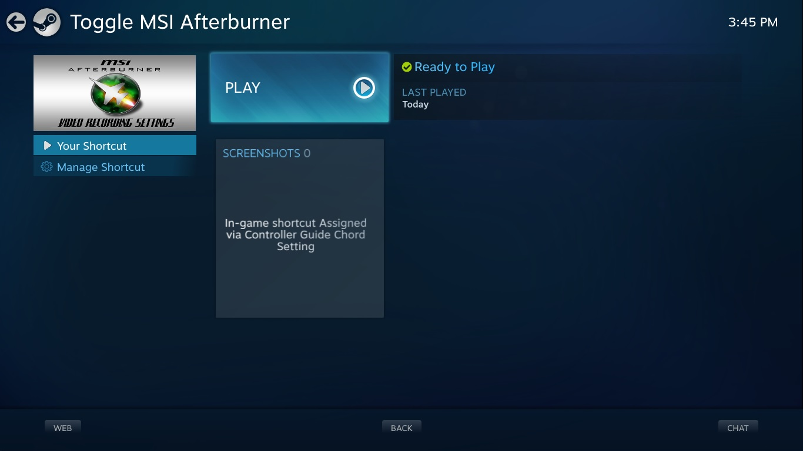

# Steam BigPicture Afterburner Toggler

## About

Easily enable/disable MSI Afterburner using a game controller in BigPicture mode with this Powershell added as a steam shortcut.

## How to Install

- Install and configure [MSI Afterburner](https://www.msi.com/Landing/afterburner/graphics-cards) with RivaTuner to show desired hardware information (make sure to uncheck "Start with windows" on both programs and check "Start minimized")

- Set execution policy mode on powershell admin with `Set-ExecutionPolicy -ExecutionPolicy RemoteSigned`

- Copy the "toggle_afterburner.ps1" script to a desired folder

- Create a Non-Steam game shortcut on Steam to any program. Edit it to run the following command: `"C:\Windows\System32\WindowsPowerShell\v1.0\powershell.exe" -ExecutionPolicy ByPass -File "\<PATH_TO_SCRIPT\>\toggle_afterburner.ps1"`

- Optional: Edit the steam shortcut to rename it and change the icon to the "steambanner.png" image included here]

- Optional: check your Windows settings for disabling UAC prompt as to use machine as a video game console